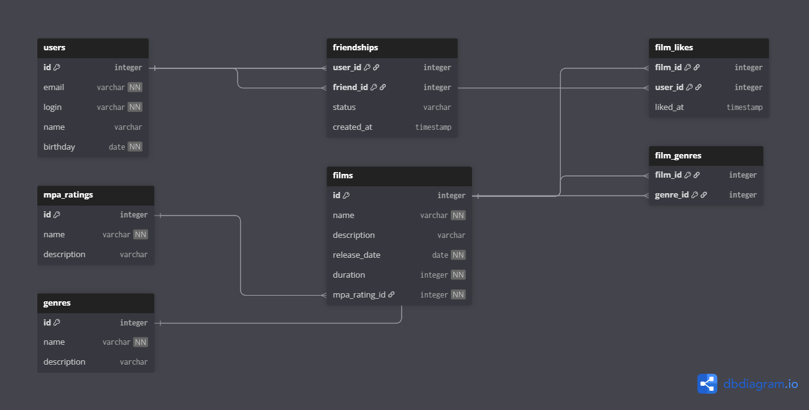

# Filmorate

Социальная сеть для оценки фильмов.

## Описание базы данных

### ER-диаграмма



### Описание таблиц

Система состоит из следующих сущностей:

- `users` — пользователи системы
- `films` — фильмы с рейтингами MPA
- `mpa_ratings` — рейтинги MPA (G, PG, PG-13, R, NC-17)
- `genres` — жанры фильмов
- `film_genres` — связь фильмов и жанров (многие-ко-многим)
- `film_likes` — лайки фильмов пользователями
- `friendships` — система дружбы между пользователями

### Структура таблиц

#### users
- `id` — уникальный идентификатор пользователя (автогенерируемый)
- `email` — электронная почта (уникальная)
- `login` — логин пользователя (уникальный, без пробелов)
- `name` — имя пользователя
- `birthday` — дата рождения (не в будущем)

#### films
- `id` — уникальный идентификатор фильма (автогенерируемый)
- `name` — название фильма
- `description` — описание фильма (до 200 символов)
- `release_date` — дата релиза (не раньше 28.12.1895)
- `duration` — продолжительность в минутах (положительное число)
- `mpa_rating_id` — ссылка на рейтинг MPA

#### mpa_ratings
- `id` — уникальный идентификатор рейтинга
- `name` — название рейтинга (G, PG, PG-13, R, NC-17)
- `description` — описание рейтинга

#### genres
- `id` — уникальный идентификатор жанра
- `name` — название жанра
- `description` — описание жанра

#### film_genres
- `film_id` — ссылка на фильм
- `genre_id` — ссылка на жанр
- Составной первичный ключ (film_id, genre_id)

#### film_likes
- `film_id` — ссылка на фильм
- `user_id` — ссылка на пользователя
- `liked_at` — время лайка (автоматически)
- Составной первичный ключ (film_id, user_id)

#### friendships
- `user_id` — пользователь, отправивший заявку
- `friend_id` — пользователь, получивший заявку
- `status` — статус дружбы (PENDING, CONFIRMED)
- `created_at` — время создания заявки (автоматически)
- Составной первичный ключ (user_id, friend_id)

## API Endpoints

### Пользователи
- `GET /users` — получить всех пользователей
- `POST /users` — создать пользователя
- `PUT /users` — обновить пользователя
- `GET /users/{id}` — получить пользователя по ID
- `PUT /users/{id}/friends/{friendId}` — добавить в друзья
- `DELETE /users/{id}/friends/{friendId}` — удалить из друзей
- `GET /users/{id}/friends` — получить список друзей
- `GET /users/{id}/friends/common/{otherId}` — получить общих друзей

### Фильмы
- `GET /films` — получить все фильмы
- `POST /films` — создать фильм
- `PUT /films` — обновить фильм
- `GET /films/{id}` — получить фильм по ID
- `PUT /films/{id}/like/{userId}` — поставить лайк
- `DELETE /films/{id}/like/{userId}` — убрать лайк
- `GET /films/popular?count={count}` — получить популярные фильмы

### Жанры
- `GET /genres` — получить все жанры
- `GET /genres/{id}` — получить жанр по ID

### Рейтинги MPA
- `GET /mpa` — получить все рейтинги MPA
- `GET /mpa/{id}` — получить рейтинг MPA по ID

## Примеры SQL-запросов

### Топ-10 самых популярных фильмов (по количеству лайков):

```sql
SELECT f.id, f.name, COUNT(fl.user_id) AS likes_count
FROM films f
LEFT JOIN film_likes fl ON f.id = fl.film_id
GROUP BY f.id, f.name
ORDER BY likes_count DESC, f.id ASC
LIMIT 10;
```

### Общие друзья двух пользователей:

```sql
SELECT u.*
FROM users u
JOIN friendships f1 ON u.id = f1.friend_id AND f1.user_id = ? AND f1.status = 'CONFIRMED'
JOIN friendships f2 ON u.id = f2.friend_id AND f2.user_id = ? AND f2.status = 'CONFIRMED';
```

### Список фильмов с жанрами и рейтингом MPA:

```sql
SELECT f.name AS film_name, g.name AS genre, m.name AS rating
FROM films f
LEFT JOIN film_genres fg ON f.id = fg.film_id
LEFT JOIN genres g ON fg.genre_id = g.id
LEFT JOIN mpa_ratings m ON f.mpa_rating_id = m.id
ORDER BY f.name, g.name;
```

### Друзья пользователя:

```sql
SELECT u.*
FROM users u
JOIN friendships f ON u.id = f.friend_id
WHERE f.user_id = ? AND f.status = 'CONFIRMED';
```

### Фильмы с количеством лайков:

```sql
SELECT f.*, COUNT(fl.user_id) AS likes_count
FROM films f
LEFT JOIN film_likes fl ON f.id = fl.film_id
GROUP BY f.id, f.name, f.description, f.release_date, f.duration, f.mpa_rating_id
ORDER BY likes_count DESC;
```

## Технологии

- **Java 21**
- **Spring Boot 3.2.4**
- **H2 Database** (встроенная база данных)
- **Spring JDBC** (NamedParameterJdbcTemplate)
- **Maven**
- **Lombok**
- **Bean Validation** (валидация данных)
- **Checkstyle** (проверка стиля кода)

## Запуск приложения

```bash
mvn spring-boot:run
```

Приложение будет доступно по адресу: http://localhost:8080

## Тестирование

### Запуск тестов
```bash
mvn test
```

### Проверка стиля кода
```bash
mvn checkstyle:check
```

### Генерация отчетов
```bash
mvn site
```

### H2 Console
Для просмотра базы данных: http://localhost:8080/h2-console

**Настройки подключения:**
- JDBC URL: `jdbc:h2:file:./db/filmorate`
- User Name: `sa`
- Password: `password`

## Особенности реализации

### База данных
- Использует H2 в файловом режиме для сохранения данных между перезапусками
- Схема создается автоматически из `schema.sql`
- Начальные данные загружаются из `data.sql`
- Добавлены индексы для ускорения поиска по лайкам и дружбе

### Валидация
- **Bean Validation** для автоматической проверки данных
- Кастомный валидатор `@ReleaseDateValid` для даты релиза фильмов
- Проверки на уровне базы данных (constraints)

### Дружба
- Реализована как односторонняя связь
- При добавлении в друзья создается запись только для инициатора
- Статус автоматически устанавливается как CONFIRMED
- Поддерживается удаление из друзей и поиск общих друзей

### Архитектура
- **Слоистая архитектура**: Controller → Service → Repository
- **Repository pattern** для работы с данными
- **NamedParameterJdbcTemplate** для безопасных SQL-запросов
- **ResultSetExtractor** для сложных JOIN-запросов
- **ResponseEntity** для контроля HTTP статусов

### HTTP статусы
- **201 Created** — при создании ресурсов
- **200 OK** — при успешных операциях
- **404 Not Found** — при отсутствии ресурсов
- **400 Bad Request** — при некорректных данных
- **500 Internal Server Error** — при попытке обновить несуществующий фильм

### Качество кода
- **Checkstyle** для проверки стиля кода
- **Lombok** для уменьшения boilerplate кода
- **Логирование** с помощью SLF4J
- **Обработка исключений** через GlobalExceptionHandler
